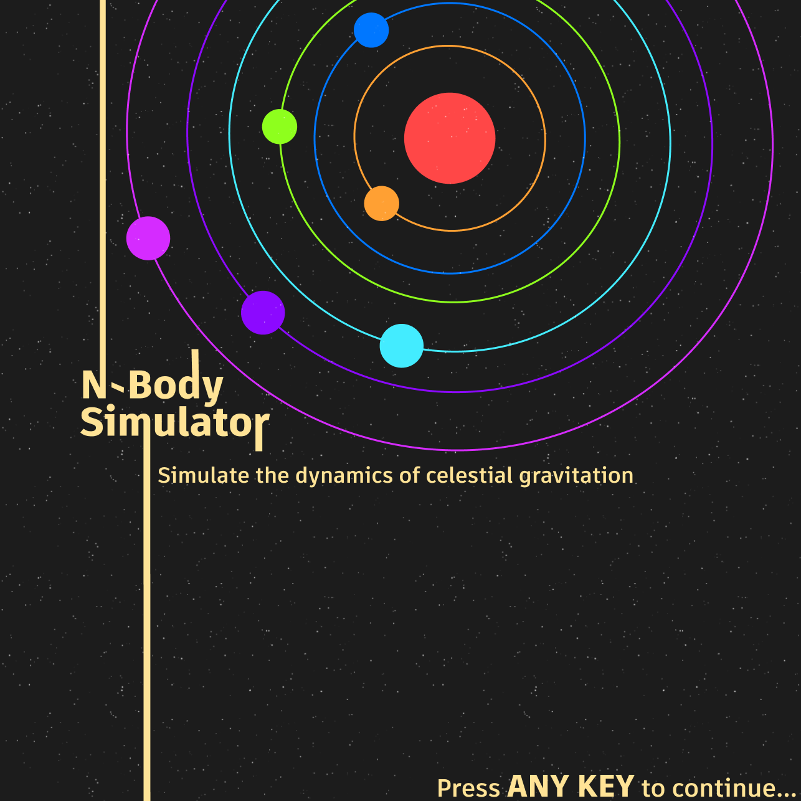

# N-Body Gravitational Simulator

A real-time interactive gravitational N-body simulator built in MATLAB App Designer. Simulates the motion of N celestial bodies under mutual gravitational attraction using Newton's law of gravitation and the Velocity Verlet integration method.

---

## Table of Contents

- [Overview](#overview)
- [Features](#features)
- [Requirements](#requirements)
- [Getting Started](#getting-started)
- [Physics](#physics)
- [Presets](#presets)
- [Controls](#controls)
- [Export](#export)
- [Project Structure](#project-structure)
- [Known Limitations](#known-limitations)
- [Authors](#authors)

---

## Overview

The N-body problem asks: given N masses in space, each attracting every other through Newtonian gravity, how do they move over time? For two bodies this has an exact analytical solution. For three or more it generally does not — the only way to study it is through numerical simulation.

This simulator computes pairwise gravitational forces between all N bodies simultaneously using vectorized MATLAB matrix operations, integrates their motion using the symplectic Velocity Verlet method, and visualizes the result in real time with trail rendering, energy monitoring, and collision detection.



---

## Features

### Physics
- **O(N²) all-pairs gravitational force computation** using fully vectorized N×N matrix operations — no explicit loops
- **Velocity Verlet integration** — symplectic integrator that conserves energy over long runs, unlike Euler or RK4
- **Softening parameter ε** — prevents singularities during close encounters by smoothing the gravitational potential
- **Elastic and inelastic collision detection** using impulse-based resolution with configurable restitution coefficient

### Visualization
- Real-time body rendering using MATLAB rectangle objects with mass-proportional sizing
- **Gradient trail system** showing orbital history for each body
- **Dynamic star field** that rescales with the camera zoom
- **Soft color palette** using HSV color model at reduced saturation for comfortable viewing
- Auto-zooming camera that keeps all bodies in frame at all times

### Energy Monitor
- Live plot of **Kinetic Energy (KE)**, **Potential Energy (PE)**, and **Total Energy (TE)**
- Flat total energy line confirms integrator accuracy
- Spikes in KE/PE during close encounters with conservation of total energy visible in real time

### UI
- 16 simulation presets with per-preset auto-configuration of G, dt, steps/tick, and radius
- **Auto-Configure** checkbox — locks optimal parameters per preset or allows manual override
- Configurable: gravitational constant, timestep, steps per tick, body count, collision mode, trail toggle, star toggle
- Real-time stats display: simulation time, step count, FPS
- Preset descriptions explaining the physics of each configuration
- Welcome screen on launch
- Button press sound feedback

### Export
- Record simulation to `.mp4` video file with configurable FPS and quality presets
- Smooth camera tracking reproduced in exported video
- ESC to cancel mid-export
- Estimated time remaining display during export
- Graceful handling of window close during export

---

## Requirements

- MATLAB R2019b or later
- App Designer support (included in base MATLAB)
- No additional toolboxes required

---

## Getting Started

1. Clone or download this repository
2. Open MATLAB and navigate to the project folder
3. Run the app:
```matlab
NBS
```
4. Press any key or click to dismiss the welcome screen
5. Select a preset from the dropdown
6. Click **RUN** to start the simulation

The app will launch maximized. All controls are in the left panel. The energy visualizer and preset description are in the right panel.

---

## Physics

### Gravitational Acceleration Kernel

For each body i, the net gravitational acceleration from all other bodies j is:

```
aᵢ = Σⱼ  G · mⱼ · (rⱼ - rᵢ) / |rⱼ - rᵢ|³
```

Computed as fully vectorized N×N matrix operations:

```matlab
dx    = pos(:,1)' - pos(:,1);          % N×N pairwise x-distances
dy    = pos(:,2)' - pos(:,2);          % N×N pairwise y-distances
r2    = dx.^2 + dy.^2 + e2;            % squared distance + softening
invR3 = r2.^(-1.5);                    % 1/r³ — no sqrt needed
invR3(1:N+1:end) = 0;                  % zero diagonal (no self-force)
fac   = G * (m') .* invR3;             % gravitational factor per pair
acc   = [sum(fac.*dx, 2), ...          % net acceleration per body
         sum(fac.*dy, 2)];
```

### Velocity Verlet Integration (Kick-Drift-Kick)

```
a₁      = acc(pos(t))                  % acceleration at current position
v(t+dt/2) = v(t) + a₁ · dt/2          % half kick
pos(t+dt) = pos(t) + v(t+dt/2) · dt   % full drift
a₂      = acc(pos(t+dt))              % acceleration at new position
v(t+dt) = v(t+dt/2) + a₂ · dt/2       % half kick
```

This is a **symplectic integrator** — it preserves a shadow Hamiltonian, keeping total energy bounded rather than drifting unboundedly as with Euler integration.

### Energy Computation

```
KE = Σᵢ  ½ · mᵢ · |vᵢ|²

PE = Σᵢ Σⱼ₍ⱼ₎ᵢ  -G · mᵢ · mⱼ / rᵢⱼ

TE = KE + PE  (should remain constant)
```

### Collision Resolution

Impulse-based collision response:

```
J = -(1 + e) · (v_rel · n̂) / (1/m₁ + 1/m₂)

v₁' = v₁ + (J/m₁) · n̂
v₂' = v₂ - (J/m₂) · n̂
```

Where `e` is the restitution coefficient: `e=1` (elastic, energy conserved), `e=0.4` (inelastic, energy lost).

---

## Presets

| Preset | Bodies | Description |
|---|---|---|
| **Figure 8** | 3 | Chenciner-Montgomery choreographic solution — three equal masses tracing a figure-eight |
| **Yarn** | 3 | Choreographic solution with intertwined woven trajectories |
| **Butterfly** | 3 | Periodic three-body orbit from the Moore family |
| **Broucke** | 3 | Broucke periodic orbit with repeated close encounters |
| **Lagrange** | 3 | Rotating equilateral triangle — classical Lagrange central configuration |
| **Henon** | 3 | Hierarchical three-body system producing spirograph patterns |
| **Random Cluster** | N | Gravitational collapse from random initial conditions |
| **Solar System** | up to 12 | Keplerian orbits with logarithmic planet spacing |
| **Binary System** | N | Two central stars with circumbinary planet orbits |
| **Square 4** | 4 | Four bodies at square corners with tangential velocities |
| **Pentagon 5** | 5 | Regular pentagon configuration producing rosette patterns |
| **Hexagon 6** | 6 | Regular hexagon configuration |
| **Heptagon 7** | 7 | Regular heptagon configuration |
| **Octagon 8** | 8 | Regular octagon configuration |
| **Nonagon 9** | 9 | Regular nonagon configuration |
| **Decagon 10** | 10 | Regular decagon configuration |

---

## Controls

### Left Panel

| Control | Description |
|---|---|
| **Preset dropdown** | Select simulation configuration |
| **Auto-Configure** | Automatically sets optimal G, dt, steps/tick, and radius for the selected preset |
| **Gravitational Constant (G)** | Scales the strength of gravity |
| **Time step (dt)** | Integration step size — smaller = more accurate but slower |
| **Steps per tick** | Physics steps computed per render frame — controls simulation speed |
| **Radius multiplier** | Scales the visual and collision size of all bodies |
| **Collision → Enable** | Toggles collision detection |
| **Collision → Elastic** | Toggles elastic (energy-conserving) vs inelastic collisions |
| **Stars** | Toggles background star field decoration |
| **Trails** | Toggles orbital trail rendering |
| **RUN / PAUSE** | Start or pause the simulation |
| **STOP** | Stop and reset the simulation |

### Right Panel

| Area | Description |
|---|---|
| **Preset Title + Description** | Physics explanation of the current preset |
| **Simulation stats** | Live T (sim time), step count, FPS |
| **Energy Visualizer** | Real-time KE, PE, and Total Energy plot |

---

## Export

1. Check **Export simulation** before running
2. Select export quality (Excellent / High / Normal / Low / Very Low)
3. Set export FPS (15–60)
4. Run the simulation — snapshots are recorded automatically
5. Click **STOP** — rendering begins immediately
6. Press **ESC** at any time to cancel export
7. The `.mp4` file is saved to the same directory as `NBS.mlapp`

> **Note:** Longer simulations and higher quality settings produce larger files and longer render times. The estimated time remaining is shown during export.

---

## Project Structure

```
NBS/
├── NBS.mlapp               # Main App Designer file
├── README.md               # This file
└── Assets/
    ├── NBSWelcome_Page.png  # Welcome screen image
    └── ButtonPressed.mp3   # Button click sound effect
```

---

## Known Limitations

- The physics engine is O(N²) — performance degrades significantly above N=30 bodies
- Choreographic presets (Figure 8, Yarn, Broucke, Butterfly) are sensitive to timestep — changing dt while Auto-Configure is off will break the orbit
- Collision detection uses circular approximation — works best with equal-mass bodies
- Exported video frame rate is limited by render speed — very complex simulations may produce lower effective FPS than specified
- Simulation time `T` is in dimensionless simulation units, not real seconds

---

## Authors

Developed for **ChE 208 Sessional** at **BUET (Bangladesh University of Engineering and Technology)**, Department of Chemical Engineering.

- **Rid** — Physics engine, integration, presets, energy monitor, export pipeline, UI architecture
- **Fuad** — Color system, video export, welcome screen, audio, deployment utilities  
- **Arefin** — Collision detection and resolution system

---

## References

- Moore, C. (1993). *Braids in classical dynamics*. Physical Review Letters, 70, 3675
- Chenciner, A. & Montgomery, R. (2000). *A remarkable periodic solution of the three-body problem*. Annals of Mathematics, 152, 881–901
- Hénon, M. (1976). *A family of periodic solutions of the planar three-body problem*. Celestial Mechanics, 13, 267–285
- Šuvakov, M. & Dmitrašinović, V. (2013). *Three classes of Newtonian three-body planar periodic orbits*. Physical Review Letters, 110, 114301
- Swope, W.C. et al. (1982). *A computer simulation method for the calculation of equilibrium constants*. Journal of Chemical Physics — original Velocity Verlet paper
